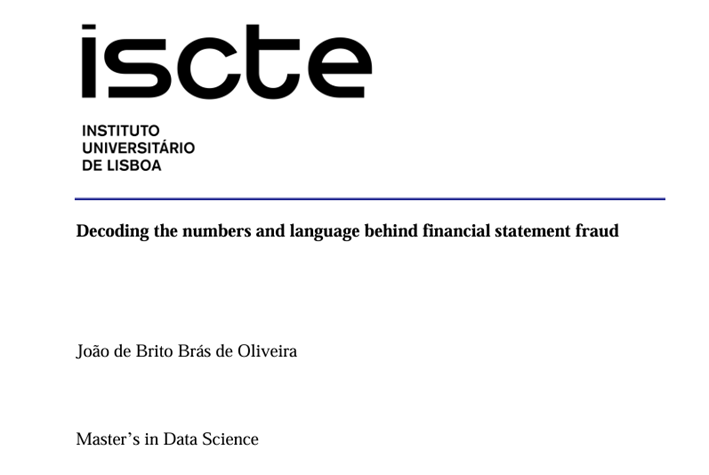
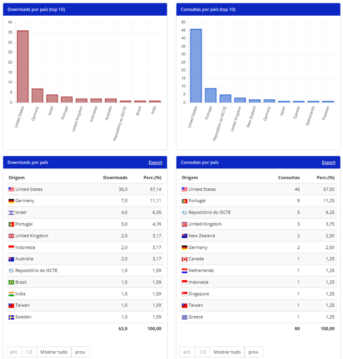

# Master’s Thesis: "_Decoding the numbers and language behind financial statement fraud_"

Tags: `Large Language Models`, `Fraud detection`, `Financial statements`, `Securities and Exchange Comission`.

## Project Overview

**Introduction:** Financial statement fraud is, a form of intentional misstatements or omissions of amounts or disclosures in financial statements designed to deceive financial statement users. External stakeholders often struggle to grasp the company's true financial situation until it is already too late, and the losses are practically irrecoverable. This highlights the need for fraud detection tools that can identify patterns and expedite the detection process, reducing costs and improving efficiency by helping direct investigations.

**Objective:** The thesis had three main research goals:
- To understand how different ways of dealing with Large Language Models max token input affected classification performance in financial statement fraud detection problems;
- To determine how Large Language Models fared against benchmark models;
- To learn if Large Language Model could assist stakeholders in signalling textual indicators/“_red-flags_” within the _Management´s Discussion and Analysis_ (MD&A) section of 10-K reports.

## Resources

  
<strong>Click the image below to access the full text of the Thesis on the University´s repository webiste </strong>

  

## Dataset Description

**Sources:** The data used was obtained via a combination of several distinct data sources and was only possible after many failures in information retrieval attempts via API´s which had incorrect information. As such the main data sources where:
- Securities and Exchange Comission website: [https://www.sec.gov/] from which a list of all file submissions from 1993 to 2024 were obtained, and are made available here: [https://www.kaggle.com/datasets/joaobrasoliveira/securities-and-exchange-comission-sec-master];
- Professor Ian Gow´s farr package data, available on the author´s Github: [https://github.com/iangow/farr]. Specifically: aaer_dates, aaer_firm_year and gvkey2cik;
- Dechow, Ge, Larson and Sloan (2011)/USCMarshall dataset, available for purchase at the following link: [https://sites.google.com/usc.edu/aaerdataset/home?authuser=0];
- Loukas, L., Fergadiotis, M., Androutsopoulos, I., & Malakasiotis, P. (2021)/EDGAR-CORPUS dataset, freely available at the following link: [https://huggingface.co/datasets/eloukas/edgar-corpus];
- Bao, Y., Ke, B., Li, B., Yu, Y. J., & Zhang, J. (2019) dataset, freely available at the author´s GitHub via the following link:[https://github.com/JarFraud/FraudDetection].

As part of the data used is proprietary it is not possible to share the datasets openly. However, free-access data is made available on the data folder, given that all authors have been given due credit.

**Structure:** The final dataset included a total of 1.850 filings, split between those involved in fraudulent (414 filings) and non-fraudulent activities (1.436 filings). For each of these filings the dataset contained the following variables:
- The text contents of the (MD&A) section;
- 42 financial variables (28 raw accounting variables + 14 financial ratios);
- The binary target label (0 - Non-Fraud and 1 - Fraud).

## To Reproduce

**Codebase:** Code excerpts for data extraction, preprocessing, model training, and evaluation are available in this repository.

**Documentation:** The thesis report provides very clear instructions on the steps followed and the code can guide along the main operations executed.

## To Cite

Oliveira, J. de B. B. de. (2024). Decoding the numbers and language behind financial statement fraud [Dissertação de mestrado, Iscte - Instituto Universitário de Lisboa]. Repositório Iscte. http://hdl.handle.net/10071/33578

## Acknowledgements

I would like to thank my supervisors for their guidance as "_There is no favorable wind for the sailor who doesn’t know where to go_" - Seneca:

- [Prof. Anabela Ribeiro Costa](https://ciencia.iscte-iul.pt/authors/anabela-ribeiro-dias-da-costa/cv): Professor at ISCTE Business School, specializing in optimization and tree algorithms.
- [Prof. Diana Aldea Mendes](https://ciencia.iscte-iul.pt/authors/diana-elisabeta-aldea-mendes/cv): Professor at ISCTE Business School, specializing in time-series analysis and and deep learning.

## Document statistics - as of 24/03/2025

